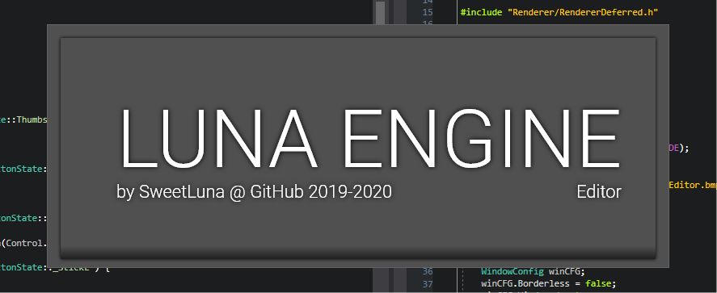
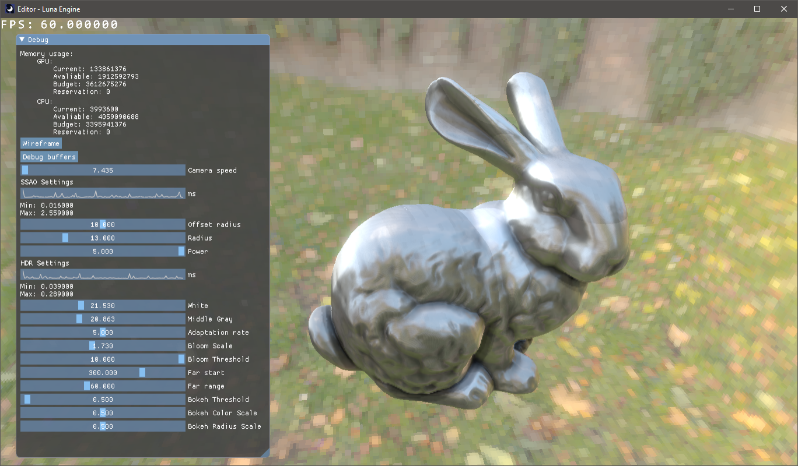
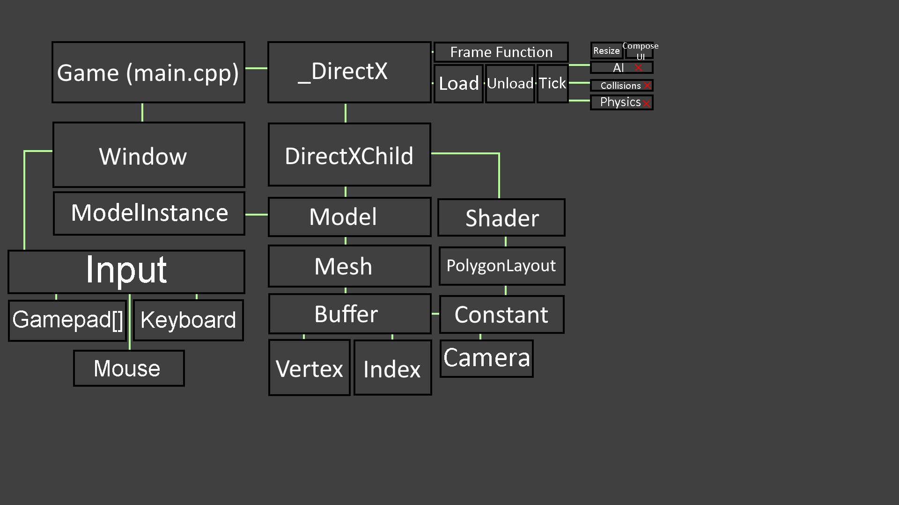

# Luna-Engine
<p align="center">
    
</p>
 
 Luna Engine is DirectX 11 based engine that i develop. Main reason why is that i want to learn more and try it all by myself

I made trello panel, so you can see what i want to do, what i already done and what i am working on atm.
https://trello.com/b/T8T6vkBN/directx-11-engine-2019

# Update VS if you see: is not the pdb file that was used when this precompiled header was created, recreate the precompiled header.

# Version 0.1.209
* Updated Main Example
* Splash screen before launching main engine!
    * Some examples are @ Compiled/Windows_Build/Bin/Engine
    * Pretty simple to use!
    ```cpp
    // Show splashscreen
    SplashScreen::Launch(L"Engine/SplashEditor.bmp", 5 * 1000);
    ```
    This line of code will create splash screen for 5 seconds from specifed image.
    
    
* Deferred Renderer is now WIP!
    * Rendering setup code is now easy!
```cpp
void _DirectX::InitGameData() {
    gRenderer = new RendererDeferred();
    
    // ...
}

void _DirectX::CreateResources() {
    // Create renderer's resources
    gRenderer->Init();
    
    // ...
}

bool _DirectX::Render() {
    static uint gRenderFrame = 0;

    // Reset counters
    gDrawCallInstanceCount = 0;
    gDispatchCallCount = 0;
    gDrawCallCount = 0;

    // Resize event
    Resize();

    // Bind and clear RTV
    gRenderer->ClearMainRT();

    // Render world
    gRenderer->Render();

    // Render to screen
    gContext->OMSetRenderTargets(1, &gRTV, gDSV);
    gRenderer->FinalScreen();

    // Debug
    gRenderer->DebugHUD();
    gRenderer->ImGui();
    
    // Handle present event
    Present(1, 0);

    // End of frame
    gRenderFrame++;
    return false;
}

void _DirectX::Resize() {
    WindowConfig wcfg = gHighLevel.DefaultResize();
    if( !wcfg.Resized ) return;

    // Resize renderer
    gRenderer->Resize();
    
    // ...
}

void _DirectX::FreeResources() {
    // Cleanup
    gRenderer->Release();
    
    // ...
}

void _DirectX::Unload() {
    SAFE_RELEASE_RENDERER(RendererDeferred, gRenderer);
}
```

* New 2D drawing functions
    * Triangle
    * CircleOuter
    * Texture
* Entity Component System is now part of LunaEngine!
* ECS based Scene system!
    * Load & add models with ease
    ```cpp
    gScene->LoadModelStaticOpaque("../Models/LevelModelOBJ.obj");
    ```
    
    * New id based camera system
    You can now create multiple cameras per single scene!
    ```cpp
    gScene->MakeCameraFOVH(0, .1f, 10000.f, 1366.f, 768.f, 70.f);
    ```
    
    * Create scene
    ```cpp
    gMainScene = new Scene();
    gMainScene->SetAsActive(); // Bind current scene as active
    
    ```
    
* New ECS based mesh system
    * Now all shaders that will be used for new Scene rendering system, must specify Layout Generator flag before loading shaders
    ```cpp
    SetLayoutGenerator(LayoutGenerator::LgMesh);
    ```
    
    * New Scene's Mesh component separates all vertex buffers into several (Position, Texcoord, Normal, etc...)
    * All other shaders will remain unaffected by this change
    
* Old camera system will be deprecated soon
* New camera control system WIP
    * Component based
    * Example of adding first person controls:
    ```cpp
    // Create input controller for player camera
    float fSpeed = 200.f;
    MovementControlComponent lMovementControlComp{};
    lMovementControlComp.mAssignedControls = {
        InputControl(VK_A, GamepadButtonState::_StickL).SetValue(0.f, 0.f, -fSpeed).OrientationDependent(),
        InputControl(VK_D, GamepadButtonState::_StickL).SetValue(0.f, 0.f, +fSpeed).OrientationDependent(),
        InputControl(VK_W, GamepadButtonState::_StickL).SetValue(+fSpeed).OrientationDependent(),
        InputControl(VK_S, GamepadButtonState::_StickL).SetValue(-fSpeed).OrientationDependent(),
        InputControl(MouseButton::AxisXY).SetValue(1.f, 1.f).OrientationUpdate()
    };

    // Create cameras
    gMainScene->MakeCameraFOVH(0, .2f, 10000.f, (float)(gRenderer->Width()), (float)(gRenderer->Height()), 70.f); // Player
    gMainScene->MakeCameraFOVH(1, .2f, 10000.f, 2048.f, 2048.f, 70.f); // Sun Light camera
    gMainScene->SetActiveCamera(0);
    gMainScene->UpdateMadeCameras();
    gMainScene->GetCamera(0)->cTransf->vPosition = float3(0.f, 10.f, 0.f);

    // Add controls to main camera
    gMainScene->AddComponent(gMainScene->GetActiveCameraHandle(), &lMovementControlComp);
    ```
    
* New utils
    * File System (WIP)
        * File Mapping
        * R/W Access
        * (In future) Virtual file system
        * Config files
    * Singleton class
    * TopologyState
    * Scoped Resource Mapping
        ```cpp
        ScopeMapConstantBuffer<Type> q(CB);
        ```
        
        Order of operations:
        * Map CB
        * Your code with q.data
        * Unmap CB
        ```cpp
        {
            ScopeMapConstantBuffer<DataBuffer> q(cbDataBuffer);
            
            q.data->_InvViewProj  = params.mInvViewProj;
            q.data->_CameraPos    = Camera::Current()->GetPosition();
            q.data->_MinFadeDist2 = params.fMinFadeDist * params.fMinFadeDist;
            q.data->_MaxFadeDist2 = params.fMaxFadeDist * params.fMaxFadeDist;
        }
        ```
        
        ```cpp
        ScopeMapConstantBufferCopy<Type> q(CB, DataPtr);
        ```
        
        Order of operations:
        * Map CB
        * Copy from DataPtr to q.data
        * Your code with q.data
        * Unmap CB
        ```cpp
        {
            // Update CB
            ScopeMapConstantBufferCopy<TransformBuff> q(cb, (void*)&this->mWorld);
        }

        cb->Bind(types, slot);
        ```
        
        Same goes for ScopedMapResource
    * Fixed CountLines powershell script
    * Wrapper for ID3D11DeviceContext::Draw* & Dispatch* calls
        * Arguments same as for ID3D11DeviceContext::* versions
    ```cpp
        DXDraw(UINT VertexCount, UINT StartVertexLocation);
        DXDrawAuto();
        DXDrawIndexed(UINT IndexCount, UINT StartIndexLocation, UINT BaseVertexLocation);
        DXDrawIndexedInstanced(UINT IndexCountPerInstance, UINT InstanceCount, UINT StartIndexLocation, UINT BaseVertexLocation, UINT StartInstanceLocation);
        DXDrawIndexedInstancedIndirect(ID3D11Buffer *pBufferForArgs, UINT AlignedByteOffsetForArgs);
        DXDrawInstanced(UINT VertexCountPerInstance, UINT InstanceCount, UINT StartVertexLocation, UINT StartInstanceLocation);
        DXDrawInstancedIndirect(ID3D11Buffer *pBufferForArgs, UINT AlignedByteOffsetForArgs);
        DXDispatch(UINT ThreadGroupCountX, UINT ThreadGroupCountY, UINT ThreadGroupCountZ);
        DXDispatchIndirect(ID3D11Buffer *pBufferForArgs, UINT AlignedByteOffsetForArgs);
    ```
    
    * Volumetric Lighting (WIP, Currently Works only for Sun Light)
    * (Screenshots were taken with MSAA 8x & full scale Volumetric Lighting)
    * HDR Luma view (WIP)
    
    
    
    
    
    
    * UI (WIP)
    * Several basic primitives UIRectangle, UIRoundrect.
    * Easy to use UIScrollbars(vertical only atm) & UIContainers!
    * Everything that is inside of the container - will be drawn relative to it's position
    * UIAtlas for UI texture atlas generation.
    
    ```cpp
        // Container example
        UIContainer c0(8.f, 81.f, 188.f, 256.f);
        
        // Scrollbar example
        UIScrollbar vsb(UIScrollbarType::Vertical);
    ```
    
    
    
    * Deferred Renderer is finally WIP!
    * Deferred PBR/IBL is WIP
    * D32S8 depth buffers are now supported by Render Targets.
        * (Doesn't support true-MSAA)
    * Basic RenderDoc integration is here!
    
    ```cpp
        // Enable RenderDoc
        // Doing such - will disable DX Debug Layer messages
        const bool RenderDocEnable = true;
        gDirectX = gHighLevel.InitDirectX(dxCFG, RenderDocEnable);
        
        // 
        void HighLevel::RenderDocCaptureBegin();
        void HighLevel::RenderDocCaptureEnd();
        void HighLevel::RenderDocLaunchUI();
        bool HighLevel::RenderDocGetUI();
    ```
    
    * Updated up to Assimp 5.0. Now engine supports PBR materials from gltf. (r: Ambient Occlusion, g: Roughness, b: Metallic)
    * More engine states
    
    ```cpp
    // Game tick function
    void Tick(float fDeltaTime);
    
    // Render frame
    bool Render();
    
    // Render UI; maybe soon deprecated
    void ComposeUI();

    // Handle resize event
    void Resize();
    
    // Game initialization
    void InitGameData(); // Allocate memory for resources
    void CreateResources(); // Will be runned 2nd time on device-lost event
                            // Desc: Create DX resources here
    void PostCreateResources(bool Recreated=false);

    // Game unloading
    void FreeResources(); // Will be runned on device-lost/game end event
                          // Desc: Release DX resources here
    void Unload(); // Game is already closing

    void Present(UINT SyncInterval, UINT Flags); // Wrapper for IDXGISwapChain::Present();
    ```
    
    * Added ``shadertoolsconfig.json`` for HLSL Tools Extension for Visual Studio
    
* Fixed
    * Crash on physics destroy event
    * Some warnings
    * Working on resolving non-released objects at the end of the app
    * 

# Version 0.1.120
* Added Attribute Vertex Clouds example. Quick and dirty.
* Some basic profiling tools for graphics debugging
    * ScopedRangeProfiler
          * Basically it calls RangeProfiler::Begin(ScopeName) and (when out of scope) RangeProfiler::End() for you.
    * RangeProfiler
          * RangeProfiler::Begin(Name); - Enters event scope
          * RangeProfiler::End(); - End of last event scope

When using RenderDoc you will see this:


```cpp
{
    ScopedRangeProfiler s1(L"Render depth buffer for directional light");
    rtDepth->Bind();
    rtDepth->Clear(0.f, 0, D3D11_CLEAR_DEPTH | D3D11_CLEAR_STENCIL);
    //                                        Default is 1 ^^^

    //rsFrontCull->Bind();
    gContext->OMSetDepthStencilState(pDSS_Default, 1);

    RenderScene(cLight, RendererFlags::DepthPass | RendererFlags::OpaquePass);
}
```


Didn't mentioned it in any of the prev. updates. Engine now uses inverse depth buffer. So the logic for shaders and CPU side code must consider this.

For example, depth msaa resolve function was: 
```cpp
[unroll(16)] // 32 - is max; 8 - max for me
for( uint i = 0; i < _SampleCount; i++ )
    depth = min(depth, _In.Load(DTid.xy, i));
```

Now it is:
```cpp
[unroll(16)] // 32 - is max; 8 - max for me
for( uint i = 0; i < _SampleCount; i++ )
    depth = max(depth, _In.Load(DTid.xy, i));
```

Depth sampling was:
```cpp
float depth = _DepthTexture.Sample(_LinearSampler, In.Texcoord);
```
Now:
```cpp
float depth = 1.f - _DepthTexture.Sample(_LinearSampler, In.Texcoord);
```
Clear for depth buffer was:
```cpp
rtDepth->Clear(1.f, 0, D3D11_CLEAR_DEPTH | D3D11_CLEAR_STENCIL);
```
Now:
```cpp
rtDepth->Clear(0.f, 0, D3D11_CLEAR_DEPTH | D3D11_CLEAR_STENCIL);
```

# Version 0.1.111
* MSAA support for RenderTargets

* Deleted old RenderBuffer* classes
* Created RenderTarget class
    * 1D/2D/3D RTV/DSV support
    * UAV for RTVs if needed
    * MSAA support
    * ArraySize support
    * Custom amount of RenderBuffers [0-8]
    * Depth buffer can present if needed
    * Cubemaps and Cubemap arrays will be added later
```cpp
RenderTarget<
    size_t dim, 
    size_t BufferNum, 
    bool DepthBuffer=false, 
    size_t ArraySize=1, 
    bool WillHaveMSAA=false, 
    bool Cube=false
>
```

# Version 0.1.101
* Screen-Space Ambient Occlusion
* Memory usage functions
    * GPU / CPU
        * Current Usage
        * Avaliable For Reservation
        * Budget
        * Current Reservation
* Working on HDR/WCG Support
* Bokeh (WIP; It's very unstanble atm)
* Depth Of Field (WIP; Must remove linear interpolation and do it with rsqrt)
* Graphs to see performance of various things
* Timer class got an update. Now you can specify several more settings
    * Log values to the console?
    * Lambda or any other type of function that will operate on destruction of Timer
* PlotData(Windows project) structure for easier work with ImGui::Plot
* Switched to inverse depth buffer (This means that only Windows project is working properly atm)


# Version 0.1.080
* Million particles test


# Requirements
* MSVS 2017+ 
   * 2019+ might ask about upgrading to newer tools, it's should still work. I haven't checked it in a while
* Platform Toolset v141+
* x86 / x64-bit system
* Windows SDK Version - 10.0.17763+
* Videocard with DX 11 support
* Target platform is Windows 10
   * It might not work on older versions
   * I plan on adding DX 12 with DXR support, so stay tuned!

# Features
* x86 / x64 builds
* 3D Particles
* 2D Particles
* Semi-Automated generartion of
    * Structured Buffer with or without UAV
    * Constant Buffer
    * Vertex Buffer
    * Index Buffer
    * Shaders
    * IA/OM/... States
    * And more!
* Render Buffers
* Model loading (avaliable all formats from Assimp)
* 2D Textures
* Cube Maps
* Physics Engine
    * Avaliable Colliders:
         * Plane
         * Sphere
         * AABB
* Audio Engine
    * Loading of WAV files
    * Usage of XInput2 library
    * Separate volume for each sound
    * Master volume
* Text Engine
    * Multiple Fonts
    * Real-Time text generation
    * Text alignment
    * SDF Rendering
* Material system
    * Support for loading and using those texture types:
      * Diffuse
      * Normal
      * Opacity
      * Specular
* Input system
    * Keyboard
    * Mouse
    * Multiple Gamepad support
* 2D Drawing API (HighLevel/DirectX/Utilities.h)
    * Circles (Filled and Outlined)
    * Rectangles
    * Lines
    * Set/Get Draw Color

* What do I plan to do in the future? / What am i working on?
    * You can check out my Trello.

# 3rd-party libs
* Assimp - For loading 
* FreeType
* ImGUI
* STB
    * Image - For loading textures
    * Vorbis (not yet implemented) - For loading ogg files



